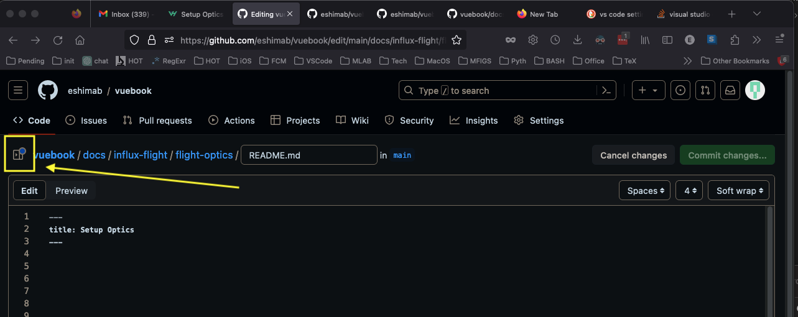
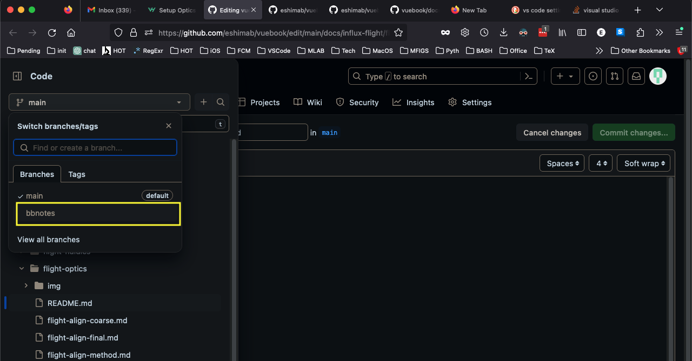
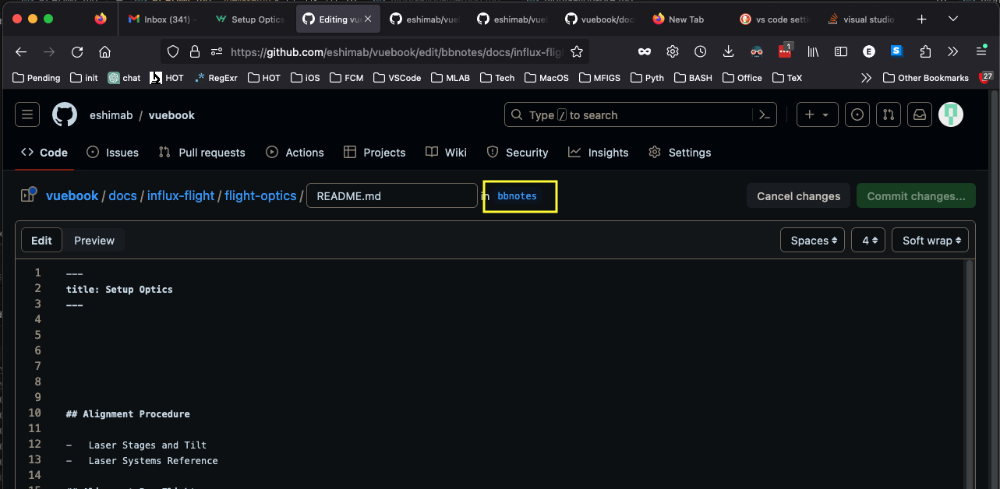
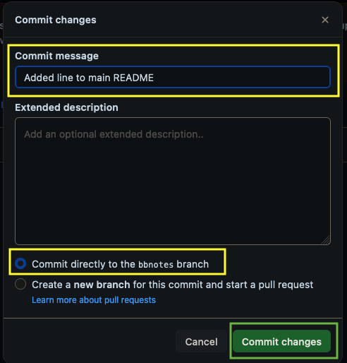
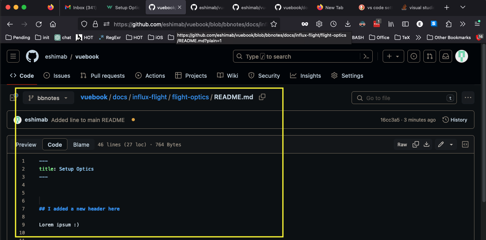
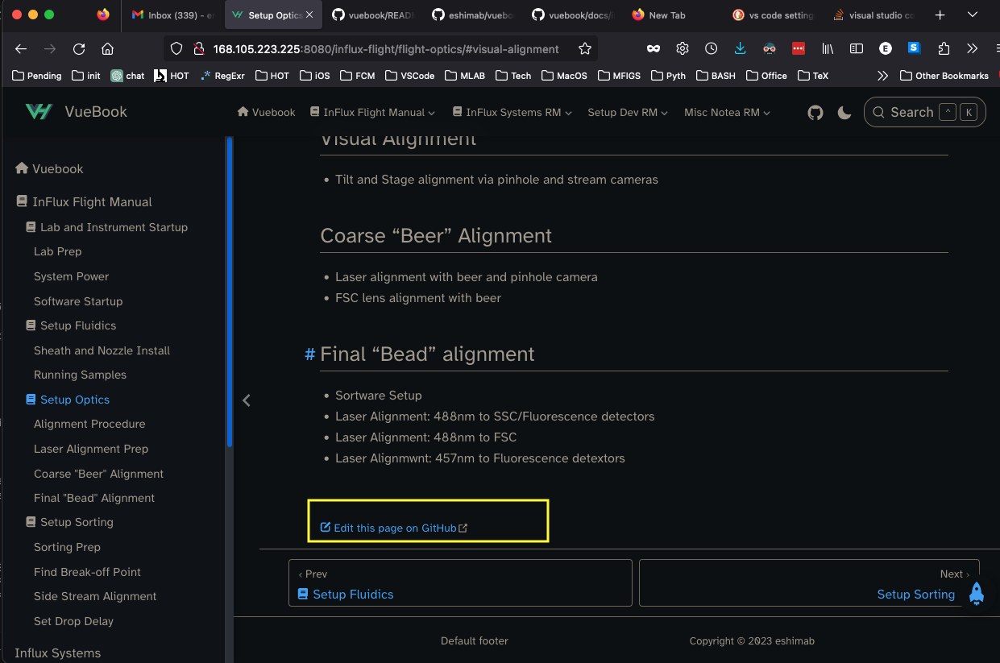
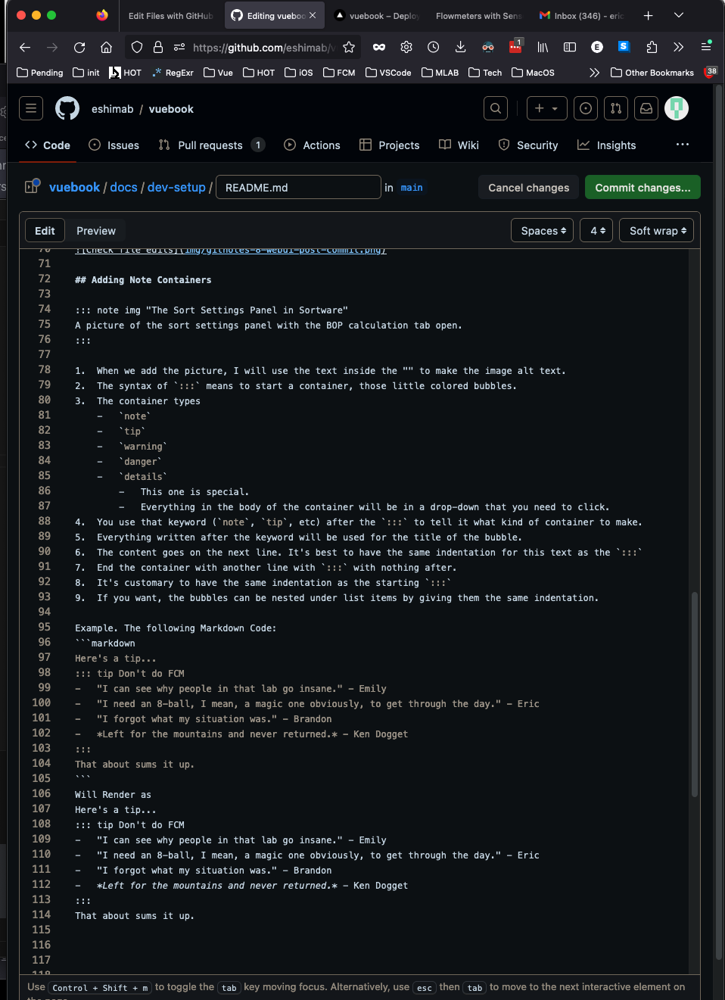
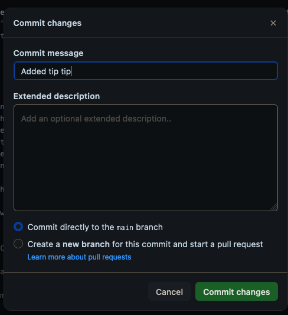
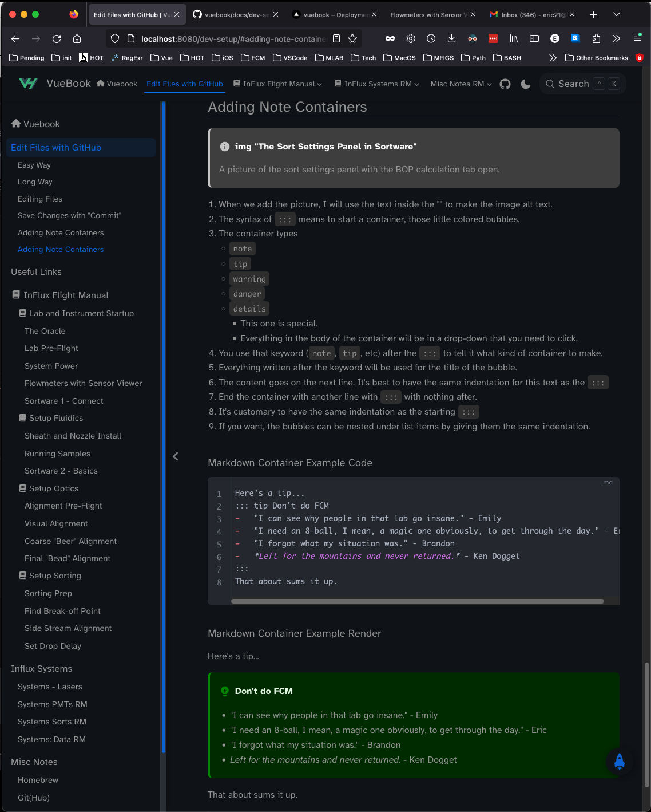

## Easy Way

Use this link to go to GitHub, and set your working branch to `bbnotes`. If you do that, skip down to **Editing Files**.

https://github.com/eshimab/vuebook/tree/bbnotes

## Long Way

On almost every page of the VueBook website, you can click the Edit This Page On GitHub link on the bottom of the page.


You could also just go to the github website:

https://github.com/eshimab/vuebook

Now you're on the GitHub page. Click the side menu button

::: figure

Caption
:::

Use the dropdown menu below `Code` on the sidebar. If the `main` branch is checked off, use the drop-down to select the branch `bbnotes`.
Using a branch prevents changes from breaking website because it only loads files from the `main` branch.



## Editing Files

Now you should be able to edit the file, and the filepath above the text editor should display the `bbnotes` branch:



If you accidentally leave the text editor, make sure that you are viewing the `Code` tab, and have the branch set to `bbnotes`. use the dropdown in the top right corner to edit the file.

Alternatively, you can click the `Code` button in the top left of the text editor window. You can see what the rendered content will look like in the `Preview` pane.


Edit the file using the text editor. You can type enumerated lists using "lazy numbers" because MarkDown till automatically number list items
```markdown
Numbered List ( Software Will automatically fix numbers)
1.  Item 1
2.  two Spaces after period
3.  Typed numbers don't really matter

-   Bullet List
-   Three spaces after dash
```

Edit the file with the text editor. If you would like to save the work, then press `Commit changes...` otherwise, press `Cancel changes` to permanently erase your edits.


## Save Changes with "Commit"

To save your work, click the `Commit changes...` button. It will open up a `Commit changes` window. A `Commit message` is required, you can leave the `Extended description` blank if you want.

-   Ensure that "Commit directly to the `bbnotes` branch" is Checked
-   Click the green `Commit changes` button



You may need to refresh your browser to see the edits. Note that if you are not set the `bbnotes` branch, the edits will not appear. 



---

## Markdown Reference Links

-   Reference Links can be defined anywhere in the document
-   The link definitions won't be rendered. 
-   Use the `[link-id]` in text to link to the reference link
-   Note that Markdown Comments are placed between `<!-- Comment Text -->`
```markdown
<!-- Reference Link Creation (anywhere in document) -->
[link-id]: ./relative/link/file.md "Optional Link Text"

<!-- Somewhere in the document -->
And then in text you can call the link with [Link Text][link-id] to create a hyperlink.
```

## Adding Images for Later

I use this to make it obvious we need a picture here.

```markdown
::: note asset "The Sort Settings Panel in Sortware"
A picture of the sort settings panel with the BOP calculation tab open.
:::
```

When we add the picture, I will use the text inside the "" to make the image alt text. 
```markdown

```

The `::: note` is part of the code syntax. `asset` indicates that "This is a request for a picture."

---

::: note Include and Image in Markdown using the following Syntax
```markdown
Figure Example Goes Here



-   Skip a line after the image to center figure and caption.
-   The img filepath is relative to this markdown file `flight-begin-meters.md`
```
:::

::: note That Markdown Code renders as
Figure Example Goes Here


-   Skip a line after the image to center figure and caption.
-   The img filepath is relative to this markdown file `flight-begin-meters.md`
:::

---

## Adding Note Containers

1.  The syntax of `:::` means to start a container, those little colored bubbles.
3.  The container types 
    -   `note`
    -   `tip`
    -   `warning`
    -   `danger`
    -   `details`
        -   This one is special.
        -   Everything in the body of the container will be in a drop-down that you need to click.
4.  You use that keyword (`note`, `tip`, etc) after the `:::` to tell it what kind of container to make.
5.  Everything written after the keyword will be used for the title of the bubble.
6.  The content goes on the next line. It's best to have the same indentation for this text as the `:::`
7.  End the container with another line with `:::` with nothing after.
8.  It's customary to have the same indentation as the starting `:::`
9.  If you want, the bubbles can be nested under list items by giving them the same indentation.
 
### Note Container Example

An example for the Markdown syntax for creating a note container. 
-   **Note Container Markdown** is what you type in your `markdownfile.md` text file
-   **Note Container Render** is that is on the website

#### Note Container Markdown

---

```markdown
Here's a tip...
::: tip Don't do FCM
-   "I can see why people in that lab go insane." - Emily 
-   "I need an 8-ball, I mean, a magic one obviously, to get through the day." - Eric
-   "I forgot what my situation was." - Brandon
-   *Left for the mountains and never returned.* - Ken Dogget
:::
That about sums it up.
```

---

#### Note Container Render

---

Here's a tip...
::: tip Don't do FCM
-   "I can see why people in that lab go insane." - Emily 
-   "I need an 8-ball, I mean, a magic one obviously, to get through the day." - Eric
-   "I forgot what my situation was." - Brandon
-   *Left for the mountains and never returned.* - Ken Dogget
:::
That about sums it up.

---

### Nesting Containers

-   If nesting the custom containers, 
    -   Outer container uses 4 colons `::::` 
    -   Inner container uses the standard 3 `:::` 
-   Indentation of the inner container is optional
    -   If you chose to indent, then do so with only 2 spaces

#### This syntax also works for nesting fenced code blocks!

-   Start code block with 4x backtick: ````markdown
-   End Code block with 4x backtick
-   See Markdown of the next section for an example
    
#### Nested Container Example Markdown

````markdown
:::: tip Outer Container has 4 colons
Outer container text Can be indented by 0-2 spaces without effect
::: note Inner Container has 3 colon and no Indentation
-   You don't have to indent the inner container
:::
Outer container text continues here
::::

:::: tip Outer Container has 4 colons
  Outer container text Can be indented by 0-2 spaces without effect
  ::: note Inner Container has 3 colons and 2 space Indentation
  -   Inner container indentation is only 2 spaces.
  -   Even though list items often use 4 
  :::
  Outer container text Can be indented by 2 spaces
::::

:::: tip Outer Container has 4 colons
    Outer container text with 4 space indent is code
    ::: note Inner Container has 3 colons and 4 space Indentation
    -   Inner container has 4 space indentation
    -   It is rendered as a verbose code block
    :::
  Outer container text with 0-2 space indent is normal
::::

:::: tip Outer Container has 4 colons
  Here is a fenced code block (superior to using the 4 space method)
  ```markdown
  Outer container text with 2 space indent
  ::: note Inner Container has 3 colons and 4 space Indentation
  -   Inner container has 4 space indentation
  -   It is rendered as a fenced code block
  :::
  ```
  Outer container text with 0-2 space indent is normal
::::
````

#### Nested Container Example Render

:::: tip Outer Container has 4 colons
Outer container text Can be indented by 0-2 spaces without effect
::: note Inner Container has 3 colon and no Indentation
-   You don't have to indent the inner container
:::
Outer container text continues here
::::

:::: tip Outer Container has 4 colons
  Outer container text Can be indented by 0-2 spaces without effect
  ::: note Inner Container has 3 colons and 2 space Indentation
  -   Inner container indentation is only 2 spaces.
  -   Even though list items often use 4 
  :::
  Outer container text Can be indented by 2 spaces
::::

:::: tip Outer Container has 4 colons
    Outer container text with 4 space indent is code
    ::: note Inner Container has 3 colons and 4 space Indentation
    -   Inner container has 4 space indentation
    -   It is rendered as a verbose code block
    :::
  Outer container text with 0-2 space indent is normal
::::

:::: tip Outer Container has 4 colons
  Here is a fenced code block (superior to using the 4 space method)
  ```markdown
  Outer container text with 2 space indent
  ::: note Inner Container has 3 colons and 4 space Indentation
  -   Inner container has 4 space indentation
  -   It is rendered as a fenced code block
  :::
  ```
  Outer container text with 0-2 space indent is normal
::::


---

## Using GitHub Example

### Edit File using GitHub UI



### Commit those changes to save the edits



### Behold your beautiful work



::: tip GitHub will not render the containers
There are many Markdown extensions, this is one of them. 
VueBook will render the containers.
Just commit edits to the `main` branch and the website will render them.
:::

---