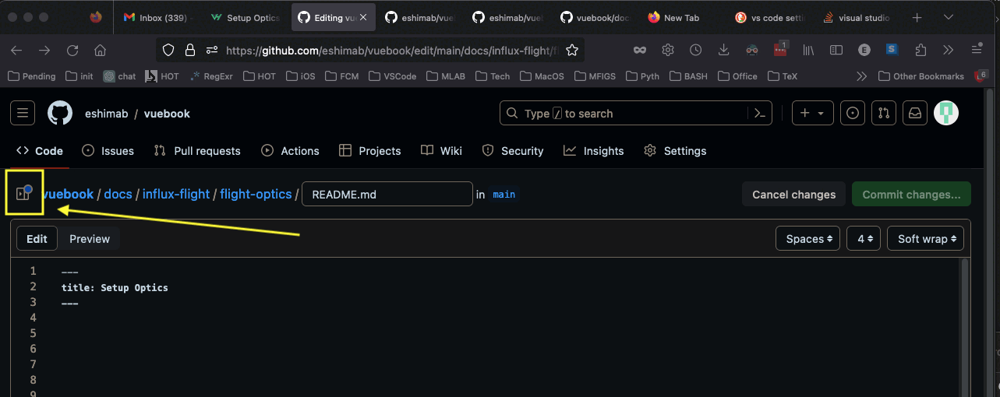
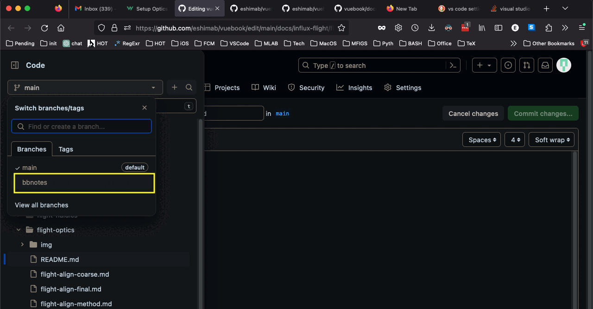
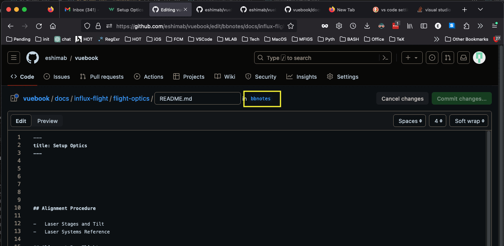
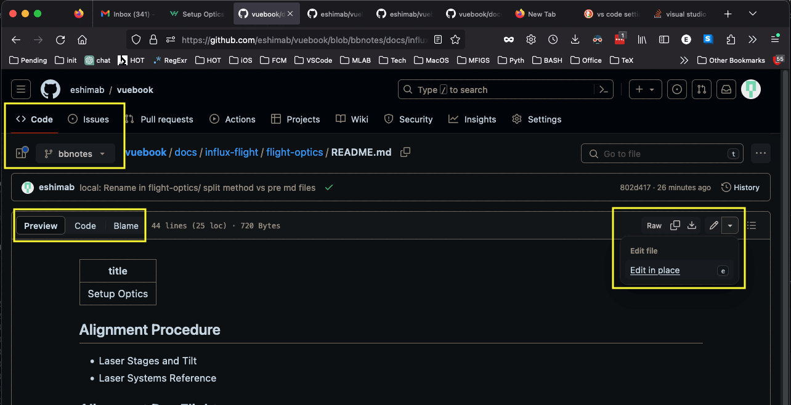
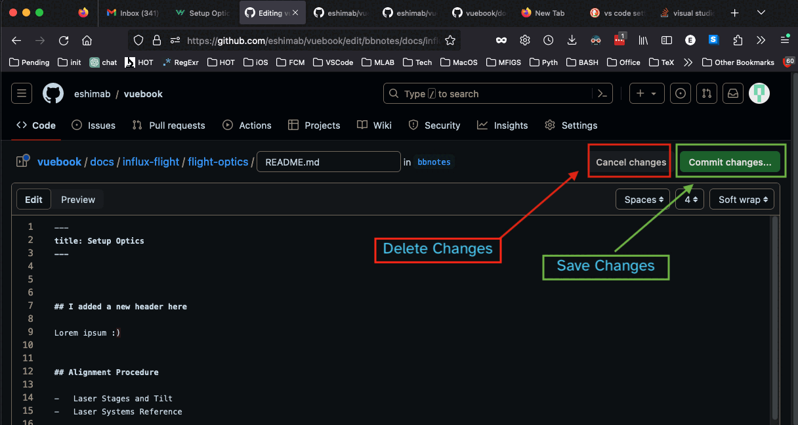
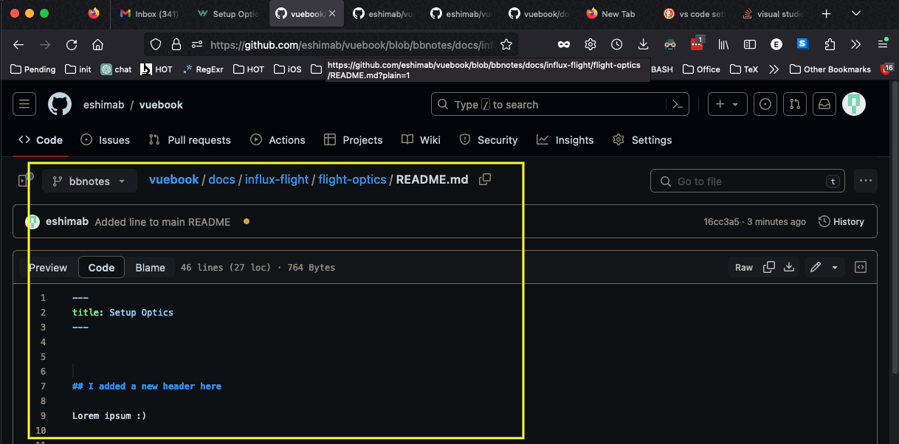
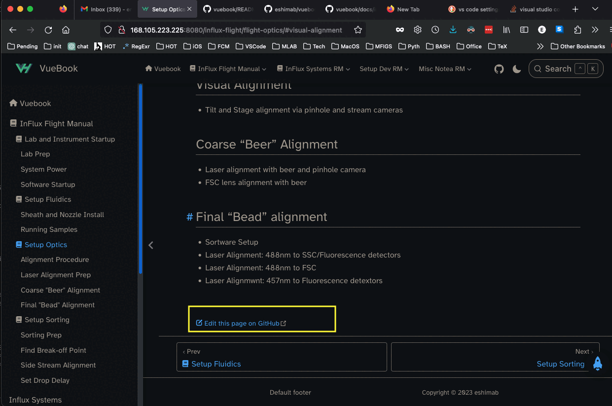
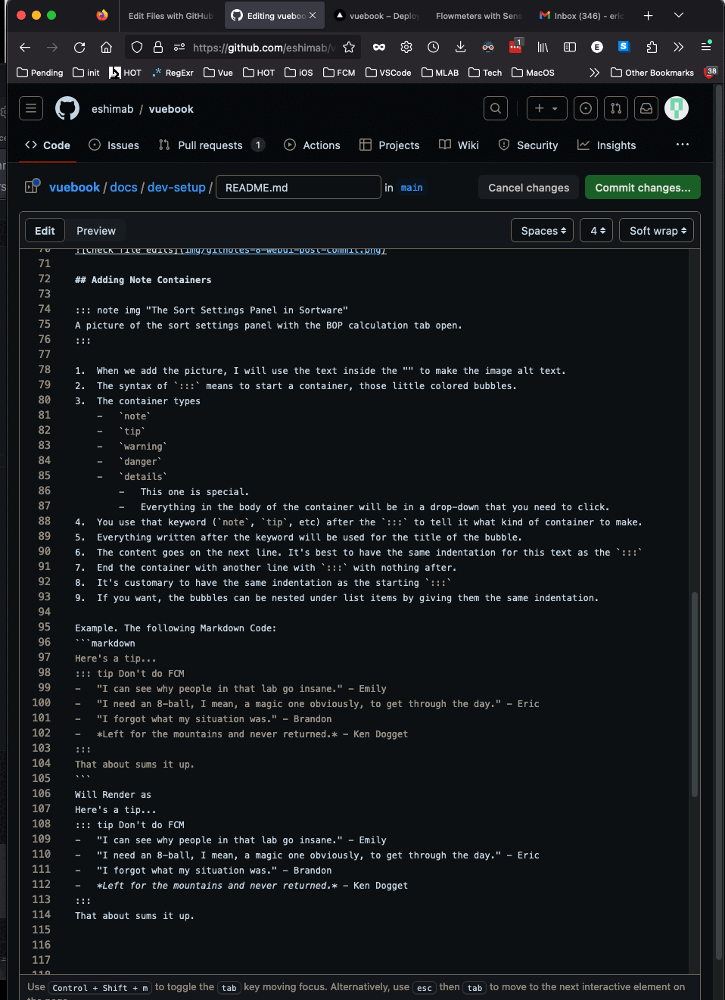
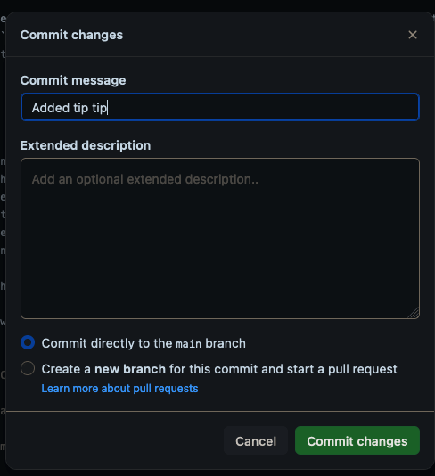
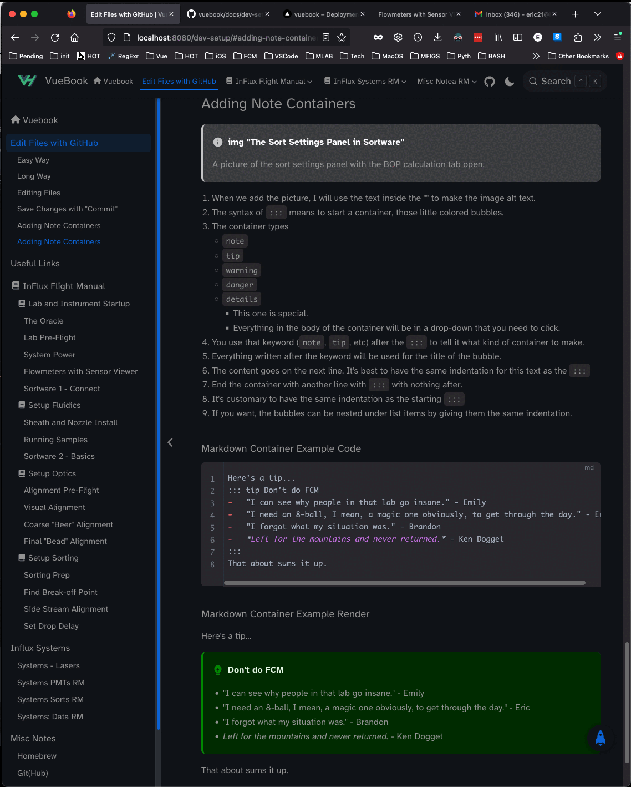

[[toc]]

## TLDR


### Setup local CLI

If you are initializing a new VuePress site with `vuepress-theme-hope`, then that command has to be run before initializing the `git` repository.

#### Install Homebrew

1. Open Terminal
2. Check local Homebrew Installation
    ```bash
    which brew
    ```
    -   If this command returns the filepath `/usr/local/bin/brew`
        -   See extended section in `dev-local.md`
    -   If it returns nothing, install Homebrew using their website
    ::: details Install Homebrew from their website
    1.  Go to https://brew.sh/
    2.  Following the instructions on the website. 
        -   As of Aug 2023, that involves just one command in terminal:
        ```sh
        /bin/bash -c "$(curl -fsSL https://raw.githubusercontent.com/Homebrew/install/HEAD/install.sh)"
        ```
        -   You may need to enter your password
    :::

#### Install npm and pnpm

1.  Check for npm and pnpm
    ```sh
    dhcp-168-105-223-225:staging eshim$ which npm
    /opt/homebrew/bin/npm
    dhcp-168-105-223-225:staging eshim$ which pnpm
    /opt/homebrew/bin/pnpm
    ```
2.  Use `brew` to `install` `npm` and `pnpm`
    ```sh
    brew install npm
    brew install pnpm
    ```
3.  Use `brew` to `install` NodeJS Version 18 (stable)
    ```sh
    brew install node@18
    ```

#### Create the vuepress-theme-hope project

1.  Create and initialize the project dir using `pnpm create`
    -   Storing the project in `/Users/username/repos/vpth`
    ```sh
    mkdir -p ~/repos # -p to not overwrite if it exists
    cd ~/repos
    pnpm create vuepress-theme-hope vpth
    ```
2.  Follow the `vuepress-theme-hope` installation instructions
    1.  Set the `package manager` to `pnpm`
    2.  Set name to `vpth` or your choice
    3.  `Version 2.0.0` (Aug 2023)
    4.  Description: Use your imagination
    5.  Licesne: I accept the default `MIT` but claim knowledge of this choice's implications
    6.  If you know enough to balance multiple languages, this guide is probably beneath you. I chose `N`o
    7.  See above for GitHub workflow
    8.  Set your type of project to `docs`
    9.  Don't initialize it as a `git repository`
    1.  After it installs, don't view the preview template
1.  Update the packages with `pnpm`. Remember to `cd ~/vpth` if necessary
    ```sh
    pnpm update
    ```
2.  Use `pnpm` to `install` additonal packages as Develop Dependencies (`devDependences`) using the `-D` flag.
    -   As of Aug 2023
    ```sh
    pnpm install -D typescript
    pnpm install -D vuepress-plugin-md-enhance
    pnpm install -D vuepress-plugin-search-pro
    pnpm install -D markdown-it-implicit-figures
    ```
1.  Check the packages installed with `pnpm list` (in the `vpth` dir)
    ```sh
    pnpm list
    ```
    -   Output (versions as of Aug 2023):
    ```sh
    Legend: production dependency, optional only, dev only

    vuebook@2.0.0 /Users/eshim/vuebook

    devDependencies:
    @vuepress/client 2.0.0-beta.66
    markdown-it-implicit-figures 0.11.0
    typescript 5.1.6
    vue 3.3.4
    vuepress 2.0.0-beta.66
    vuepress-plugin-md-enhance 2.0.0-beta.234
    vuepress-plugin-search-pro 2.0.0-beta.234
    vuepress-theme-hope 2.0.0-beta.234
    ```
2.  Use `pnpm` to `update` all the installed packages
    ```sh
    pnpm update
    ```
3.  Change the name of the `vpth/src` directory to `vpth/docs` (you can do this in Finder too)
    ```sh
    cd ~/repos/vpth
    mv ./src ./docs
    ```
4.  Configure the `vpth/package.json` file
    1.  Alter the `script` commands by changing `src` to `docs`.
        -   This is because we renamed the VuePress root directory from `vpth/src/` to `vpth/docs/`
    2.  Add the `--port` flag to the `docs:dev` `script` to change the `localhost` site from the default `8080` to `8082`
        -   The default port is `8080` and if you do not specify a `--port` then the server will run on `http://localhost:8080`
        -   If you want to run multiple instances of VuePress on your local machine, then they need to have different ports.  
    -   If you have not altered the `package.json` file, it will look similar to this:
    ```json {8-11}
    {
      "name": "vuepress-theme-hope-template",
      "version": "2.0.0",
      "description": "A project of vuepress-theme-hope",
      "license": "MIT",
      "type": "module",
      "scripts": {
        "docs:build": "vuepress build docs",
        "docs:clean-dev": "vuepress dev docs --clean-cache",
        "docs:dev": "vuepress dev docs --port 8082",
        "docs:update-package": "pnpm dlx vp-update"
      },
      "devDependencies": {
        "@vuepress/client": "2.0.0-beta.66",
        "markdown-it-implicit-figures": "^0.11.0",
        "typescript": "^5.1.6",
        "vue": "^3.3.4",
        "vuepress": "2.0.0-beta.66",
        "vuepress-plugin-md-enhance": "2.0.0-beta.234",
        "vuepress-plugin-search-pro": "2.0.0-beta.234",
        "vuepress-theme-hope": "2.0.0-beta.234"
      }
    }
    ```
5.  You can now use `pnpm` to `run` to run the script `docs:dev` (by default, line 10 of the `package.json` file, in the `"scripts"` list)
    ```sh
    pnpm run docs:dev
    ```
6.  Check your web browser by going to `http://localhost:8080`
    -   If you modify a configuration file that causes the local server to crash, you can restart it using the `pnpm run docs:dev` command again.
    -   You may need to manually restart the server for some changes. Use `ctrl + C` in the Terminal window to cancel the active command and use `pnpm run docs:dev` to start the server.


### Setup Git

#### Create GitHub Repository

I think that it's easier to create the repository using the website than to initialize the online repo with a push.


#### Initialize local Git Repository

1.  See if `git` is installed (Usually ships on Mac)
    ```sh
    git version
    ```
    -   Not installed? https://github.com/git-guides/install-git
2.  Initialize `~/repos/vpth` as a `git` project
    ```sh
    cd ~/repos/vpth
    git init .
    ```
    -   Should Return
    ```sh
    Initialized empty Git repository in /Users/username/repos/vpth/.git/
    ```
3.  Set the `remote` GitHub repository URL
    1.  `add` a new `remote` alias
    2.  Give the alias a nickname `vpmain`
    3.  Assign the `vpmain` alias to the GitHub url: `https://github.com/YourUserName/vpthproj`
    ```sh
    git remote add vpmain https://github.com/eshimab/vpthproj
    ```
    -   Verify installation with 
    ```sh
    git remote --verbose
    ```
    -   Which returns
    ```sh
    vpmain  https://github.com/eshimab/vpthproj (fetch)
    vpmain  https://github.com/eshimab/vpthproj (push)
    ```

### A fork in the code

#### Starting a new repo

1.  Create a `.gitignore` file
        -   This prevents `git` from backing up large files and folders.
    ```sh
    touch ~/repos/vpth/.gitignore
    ```
    -   Use a text editor to add these lints to the file, then save it
    ```sh
    # ------------------ Directories
    # npm / pnpm installed modules
    node_modules
    # Temp Directories for VuePress local server
    /docs/.vuepress/.cache/
    /docs/.vuepress/.temp/
    # VuePress Build Distribution
    /docs/.vuepress/dist/
    # ------------------ Files 
    # This is a Mac specific tracking file in every dir
    *.DS_Store
    ```
    -   The `#` is used for comments
    -   `.DS_Store` is a file created by macOS in every folder for record keeping.
5.  When `git` is initialized, it may track the `node_modules` directory even if it was in the `.gitignore` file
    1.  After saving the new `.gitignore` file, start a new Terminal window and use `cd ~/repos/vpth` to move back to the project root directory.
    2.  Use this command, it will report nothing done if `node_modules` is successfully ignored
        ```sh
        git rm -r --cached node_modules
        ```
1. Check your `git status`
       ```sh
       git status
       ```
2.  You should have untracked documents:
    3.  Remember you can use TAB to auto-complete, but only as far as the unique characters in the file or dir name allow.
    ```sh
    .gitignore
    docs 
    package.json
    pnpm-lock.yaml
    ```
3.  Add the documents to `git` traking with `git add`. This command is recursive by default.
    ```sh
    git add docs
    git add .gitingore
    git add package.json
    git add pnpm-locl.yaml
    ```
4.  Ensure that those files and all sub-directories and files in `docs/` are ready for staging with another `git status`
5.  Create a local `commit` to prepare to upload to the remote GitHub repo
    6.  Use the `-m` flag to include a message bounded by parentheses.
    7.  Every `commit` must have a message.
6.  ```sh
    git commit -m "First commit"
    ```
1.  Use `push` to sync the staged local `commit` of the `master` branch to the `remote` GitHub repository using the remote alias `vpmain`. 
    ```sh
    git push vpmain master
    ```
2.  The default name for the primary `git` `branch` is `master`. We will change it to `main`, but that is optional.
    1.  Change the `branch` name on the GitHub website. 
        1.  Go to the GitHub repository page and click the `Settings` tab 
            1.  https://github.com/USERNAME/vpthproj/settings
        2.  Find the `Default branch` section and edit the field by clicking the pencil icon
        3.  Enter `main` in the popup window and click `Rename branch`
        4.  Reload the page
    2.  Change the local `branch` to `main`
        1.  Starting in the `~/vpth` directory:
        ```sh
        # Rename the local "master" branch to "main"
        git branch -m master main
        # Push the new branch name "main" to the remote repository
        git push -u vpmain
        
        ```
    3.  Test the connection by modifying a file (eg change the `heroText` in `vpth/docs/README.md`) to your website tagline.
        ```sh
        cd ~/repos/vpth
        git add docs/README.md
        git commit -m "Testing push"
        git push vpmain main
        ```
    4.  Then update the upstream branch for future pushes/pulls
        ```sh
        git branch --set-upstream-to=vpmain/main main
        ```
1.  Add some `.gitkeep` files to sync otherwise ignored/empty directories. You may need to create the directory with `mkdir`. Use the `mkdir` flag `-p`  to not risk over-writing the directories in they exist:
    ```sh
    # To go project root dir
    cd ~/repos/vpth
    # Make the .vuepress subdirs
    mkdir -p ~/repos/vpth/docs/.vuepress/.cache/
    mkdir -p ~/repos/vpth/docs/.vuepress/.temp/
    mkdir -p ~/repos/vpth/docs/.vuepress/dist/
    # Make the .gitkeep files
    touch ~/repos/vpth/docs/.vuepress/.cache/.gitkeep
    touch ~/repos/vpth/docs/.vuepress/.temp/.gitkeep
    touch ~/repos/vpth/docs/.vuepress/dist/.gitkeep
    ```
    -   Use `git push` to send these changes to the GitHub repository using the alias `vpmain`. Send the `main` (should be the only) branch.
    ```sh
    cd ~/repos/vpth
    git add docs
    git commit -m "Updating empty dirs with .gitkeep files"
    git push vpmain main
    ```


#### Pulling from an established repo

1.  `pull` a copy of the files 
    1.  Use the `vpmain` alias to point to the GitHub URL 
    2.  Select the `main` branch (for our use case)
    ```sh
    git pull vpmain main
    ```


## Config VuePress


---

## Ignore Files

-   You **must** setup a `.gitignore` file in the root directory so that `git` does not backup large files or directories.
-   `eshimab/vuebook` repo contains a `.gitignore` file that should be downloaded during your first `pull`
-   In the `.gitignore` file, you use `#` for comments
-   The filepaths are relative to the root `git` directory, in this case `vuebook`
-   End a directory with `/` to recursively ignore everything in that directory
-   On MacOS, most folders have a hidden file `.DS_Store` that is a record keeping file. 
    -   Ignore these files because they will cause conflicts.
-   Ensure that in `~/vuebook/.gitignore` you have:
```sh
# ------------------ Directories
# npm / pnpm installed modules
/node_modules/
# Temp Directories for VuePress local server
/docs/.vuepress/.cache/
/docs/.vuepress/.temp/
# VuePress Build Distribution
/docs/.vuepress/dist/
# oversized assets
/oversized-assets/
# ------------------ Files
*.DS_Store
```

### gitignore Syntax

```sh
# Ignore all files with .txt extension
*.txt
# Ignore all files in the "logs" directory
/logs/
# Exception: Include "important.txt" even though it has .txt extension
!important.txt
# Exception: Include everything in the "logs" directory
!/logs/*
```

## Long Way

On almost every page of the VueBook website, you can click the Edit This Page On GitHub link on the bottom of the page.


You could also just go to the github website:

https://github.com/eshimab/vuebook

Now you're on the GitHub page. Click the side menu button

::: figure

Caption
:::

Use the dropdown menu below `Code` on the sidebar. If the `main` branch is checked off, use the drop-down to select the branch `bbnotes`.
Using a branch prevents changes from breaking website because it only loads files from the `main` branch.



## Editing Files

Now you should be able to edit the file, and the filepath above the text editor should display the `bbnotes` branch:



If you accidentally leave the text editor, make sure that you are viewing the `Code` tab, and have the branch set to `bbnotes`. use the dropdown in the top right corner to edit the file.

Alternatively, you can click the `Code` button in the top left of the text editor window. You can see what the rendered content will look like in the `Preview` pane.



Edit the file using the text editor. You can type enumerated lists using "lazy numbers" because MarkDown till automatically number list items
```markdown
Numbered List ( Software Will automatically fix numbers)
1.  Item 1
2.  two Spaces after period
3.  Typed numbers don't really matter

-   Bullet List
-   Three spaces after dash
```

Edit the file with the text editor. If you would like to save the work, then press `Commit changes...` otherwise, press `Cancel changes` to permanently erase your edits.



## Save Changes with "Commit"

To save your work, click the `Commit changes...` button. It will open up a `Commit changes` window. A `Commit message` is required, you can leave the `Extended description` blank if you want.

-   Ensure that "Commit directly to the `bbnotes` branch" is Checked
-   Click the green `Commit changes` button


You may need to refresh your browser to see the edits. Note that if you are not set the `bbnotes` branch, the edits will not appear. 



---

## Markdown Reference Links

-   Reference Links can be defined anywhere in the document
-   The link definitions won't be rendered. 
-   Use the `[link-id]` in text to link to the reference link
-   Note that Markdown Comments are placed between `<!-- Comment Text -->`
```markdown
<!-- Reference Link Creation (anywhere in document) -->
[link-id]: ./relative/link/file.md "Optional Link Text"

<!-- Somewhere in the document -->
And then in text you can call the link with [Link Text][link-id] to create a hyperlink.
```

## Adding Images for Later

I use this to make it obvious we need a picture here.

```markdown
::: note asset "The Sort Settings Panel in Sortware"
A picture of the sort settings panel with the BOP calculation tab open.
:::
```

When we add the picture, I will use the text inside the "" to make the image alt text. 
```markdown

```

The `::: note` is part of the code syntax. `asset` indicates that "This is a request for a picture."

---

::: note Include and Image in Markdown using the following Syntax
```markdown
Figure Example Goes Here



-   Skip a line after the image to center figure and caption.
-   The img filepath is relative to this markdown file `flight-begin-meters.md`
```
:::

::: note That Markdown Code renders as
Figure Example Goes Here


-   Skip a line after the image to center figure and caption.
-   The img filepath is relative to this markdown file `flight-begin-meters.md`
:::

---

## Adding Note Containers

1.  The syntax of `:::` means to start a container, those little colored bubbles.
3.  The container types 
    -   `note`
    -   `tip`
    -   `warning`
    -   `danger`
    -   `details`
        -   This one is special.
        -   Everything in the body of the container will be in a drop-down that you need to click.
4.  You use that keyword (`note`, `tip`, etc) after the `:::` to tell it what kind of container to make.
5.  Everything written after the keyword will be used for the title of the bubble.
6.  The content goes on the next line. It's best to have the same indentation for this text as the `:::`
7.  End the container with another line with `:::` with nothing after.
8.  It's customary to have the same indentation as the starting `:::`
9.  If you want, the bubbles can be nested under list items by giving them the same indentation.
 
### Note Container Example

An example for the Markdown syntax for creating a note container. 
-   **Note Container Markdown** is what you type in your `markdownfile.md` text file
-   **Note Container Render** is that is on the website

#### Note Container Markdown

---

```markdown
Here's a tip...
::: tip Don't do FCM
-   "I can see why people in that lab go insane." - Emily 
-   "I need an 8-ball, I mean, a magic one obviously, to get through the day." - Eric
-   "I forgot what my situation was." - Brandon
-   *Left for the mountains and never returned.* - Ken Dogget
:::
That about sums it up.
```

---

#### Note Container Render

---

Here's a tip...
::: tip Don't do FCM
-   "I can see why people in that lab go insane." - Emily 
-   "I need an 8-ball, I mean, a magic one obviously, to get through the day." - Eric
-   "I forgot what my situation was." - Brandon
-   *Left for the mountains and never returned.* - Ken Dogget
:::
That about sums it up.

---

### Nesting Containers

-   If nesting the custom containers, 
    -   Outer container uses 4 colons `::::` 
    -   Inner container uses the standard 3 `:::` 
-   Indentation of the inner container is optional
    -   If you chose to indent, then do so with only 2 spaces

#### This syntax also works for nesting fenced code blocks!

-   Start code block with 4x backtick: ````markdown
-   End Code block with 4x backtick
-   See Markdown of the next section for an example
    
#### Nested Container Example Markdown

````markdown
:::: tip Outer Container has 4 colons
Outer container text Can be indented by 0-2 spaces without effect
::: note Inner Container has 3 colon and no Indentation
-   You don't have to indent the inner container
:::
Outer container text continues here
::::

:::: tip Outer Container has 4 colons
  Outer container text Can be indented by 0-2 spaces without effect
  ::: note Inner Container has 3 colons and 2 space Indentation
  -   Inner container indentation is only 2 spaces.
  -   Even though list items often use 4 
  :::
  Outer container text Can be indented by 2 spaces
::::

:::: tip Outer Container has 4 colons
    Outer container text with 4 space indent is code
    ::: note Inner Container has 3 colons and 4 space Indentation
    -   Inner container has 4 space indentation
    -   It is rendered as a verbose code block
    :::
  Outer container text with 0-2 space indent is normal
::::

:::: tip Outer Container has 4 colons
  Here is a fenced code block (superior to using the 4 space method)
  ```markdown
  Outer container text with 2 space indent
  ::: note Inner Container has 3 colons and 4 space Indentation
  -   Inner container has 4 space indentation
  -   It is rendered as a fenced code block
  :::
  ```
  Outer container text with 0-2 space indent is normal
::::
````

#### Nested Container Example Render

:::: tip Outer Container has 4 colons
Outer container text Can be indented by 0-2 spaces without effect
::: note Inner Container has 3 colon and no Indentation
-   You don't have to indent the inner container
:::
Outer container text continues here
::::

:::: tip Outer Container has 4 colons
  Outer container text Can be indented by 0-2 spaces without effect
  ::: note Inner Container has 3 colons and 2 space Indentation
  -   Inner container indentation is only 2 spaces.
  -   Even though list items often use 4 
  :::
  Outer container text Can be indented by 2 spaces
::::

:::: tip Outer Container has 4 colons
    Outer container text with 4 space indent is code
    ::: note Inner Container has 3 colons and 4 space Indentation
    -   Inner container has 4 space indentation
    -   It is rendered as a verbose code block
    :::
  Outer container text with 0-2 space indent is normal
::::

:::: tip Outer Container has 4 colons
  Here is a fenced code block (superior to using the 4 space method)
  ```markdown
  Outer container text with 2 space indent
  ::: note Inner Container has 3 colons and 4 space Indentation
  -   Inner container has 4 space indentation
  -   It is rendered as a fenced code block
  :::
  ```
  Outer container text with 0-2 space indent is normal
::::


---

## Using GitHub Example

### Edit File using GitHub UI



### Commit those changes to save the edits



### Behold your beautiful work



::: tip GitHub will not render the containers
There are many Markdown extensions, this is one of them. 
VueBook will render the containers.
Just commit edits to the `main` branch and the website will render them.
:::

---