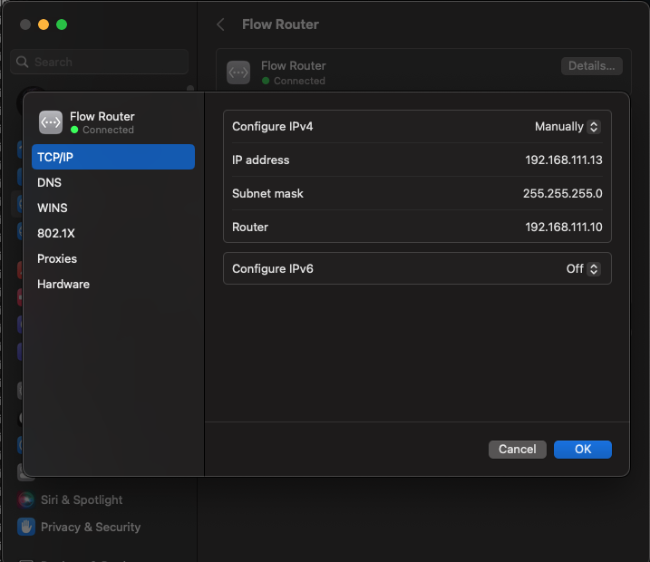

<!-- filename: /docs/influx-flight/ifm-01-startup/ifm-01p02-system-power.md -->

<!-- Reference Links -->
<!-- Usage -->
<!-- [img-label]: ./assets/filename.png -->
<!-- ![Caption Text][img-label] -->
<!-- Assets -->
[img-macNetworkConfig]: ./assets/img-01p04-sortware-part1-connect/img-01p04-setupMacNetworkFlowRouter.png  
[img-macConnect]: ./assets/img-01p04-sortware-part1-connect/img-01p04-setupMacFinderConnectToServer.png
<!-- URLs -->

<!-- End Ref Links -->


[[toc]]

<!-- ::: details OG Manual  -->

## 1.1.0 Start Computer

## 1.1.2 Turn On Computers & Start Software

The Workstation is comprised of two computers connected via a router. 

### 1.1.2.0 Check Router

::: note asset Router

:::

1. The router should be plugged in and on.
2. The first and second ports on the rear of the router should be connected to:
    1. Dell PC
    2. HP PC
    3. User's laptop (Optional)

### 1.1.2.1 Start Dell PC (CytoServer)


[img-pcFront]: ./assets/img-01p02-system-power/img-01p02-power-workstation-pcsOn.png
![Workstatiom cart front][img-pcFront]

Front of the workstation cart where the PCs, Marshal Monitors, Oscilliscope, Main system power, and router are stored.


1.  Ensure that the InFlux Instrument is powered On.
2.  Ensure the device and it's peripherals are plugged in:
    1.  Dell PC to Always-On powerstrip
    2.  Dell PC Monitor ("Dell Monitor") to Always-On powerstrip
    3.  Dell PC to Dell Monitor via DVI-to-VGA Adapter and VGA Cable.
    4.  Dell PC to Router (typically, second port) via Ethernet
    5.  Dell PC Keyboard (in front of the Monitor) to Dell PC
    6.  *Note:* This PC does not have a mouse plugged in by default. If you want to use one, it must be a *wired* USB mouse.
3.  Power On the PC and Monitors using front panel button.

[img-dellPeriph]: ./assets/img-01p02-system-power/img-01p02-power-workstation-dellPeriph-anno.png
![Del Peripherals][img-dellPeriph]

4.  During the initial boot, you will get a Warning about the System Battery being Low
    ```sh
    Alert! System Battery voltage is low.
     Strike the F1 key to continue, F2 to run the setup utility.
      Press F5 to run onboard diagnostics
    ```
    1.  Press the F1 key on the Dell PC Keyboard to continue booting.
    2.  The Dell PC should emit two short beeps once it boots to the login screen. This means that the InFlux Instrument is powered on and connected to the Dell PC via the router.

    ::: note Dell PC Error Beeps
    If the Dell PC begins to beep an error code of 3 long beeps in quick succession, then it is not connected to the InFlux Instrument.
    3.  Is the InFlux Powered on?
    4.  Is the router powered on?
    5.  Is the Dell PC connected to the router?
    6.  Is it still beeping?
        1.  Go to network troubleshooting, you lucky dog.
    :::

5. Use the login info recorded locally.
    1. To get to the password entry without a mouse 
            1. Press TAB twice to open the password field
        1. Type in the locally recorded password 
        2. Press ENTER
    2. *Note* You can use TAB to move around the login window to turn off the computer.
6. Wait for this PC to boot up and login to Desktop before proceeding


### 1.1.2.2 Start HP PC 

1. Ensure the InFlux Instrument, Router, and Dell PC are all On.
2. Ensure the HP PC and its peripherals are plugged in:
    1. HP PC to Always-On powerstrip
    2. HP PC Monitor ("LG Monitor") to Always-On powerstrip
    3. HP PC to LG Monitor via DisplayPort cable
    4. HP PC to Router (typically, second port) via Ethernet
    5. HP PC Keyboard (Wireless, "Logitech G613" , USB Dongle "G613" in Front Panel USB-2.0 Port)
    5. HP PC Mouse (Wireless, "Logitech" , USB Dongle "MTA8" in Front Panel USB-2.0 Port)
3. Power On the HP PC using Front Panel Switch. 
4. Power On LG Monitor using button on bottom/center of monitor.
5. Use the login info recorded locally

### 1.1.2.3 Start Sortware

::: tip Start Sortware and Connect to Cytometer
It’s best to make sure that Sortware can connect to the instrument before doing any more setup. If Sortware cannot Connect to Cytometer, you may need to power cycle the Instrument, potentially impeding alignment.
:::

::: warning Check Sort Chamber before connecting to Cytometer
-   Be sure that the Sort Chamber is free of any loose objects (beakers, syringes, etc) before Connecting Sortware to the Cytometer. 
-   When the cytometer connects to Sortware, the Sort Tray will perform a homing movement to center the tray.
-   Any objects which block the free movement of the Sort Tray aparatus will cause a mis-alignment between the coordinates in the Sortware Tray Control and the physical location of the sort tray.
:::


To start Sortware and Connect to Cytometer:

1.  Ensure that the Dell PC isn't making any error noises. 
2.  On the HP PC, click the *Sortware* icon in the menu bar on the top of the screen. 
2.  Go to the menu item `Cytometer > Connect to Cytometer`
3.  In should report a successful connection.
    4.  If the Cytometer Settings panel is open, the Status tab should not have a red symbol on it.
    5.  The symbol will appear if there are connection problems with the instrument.
    6.  The symbol may not be cleared automatically. You will need to click `Clear` in the `Status` tab of the `Cytometer Settings` panel. 
    :::: note Unable to Connect?
    If the `Connect` button is greyed out or the software "Fails to connect to the cytometer:"
    ::: note details Attempt simple power cycling
    1.  Shutdown the HP and Dell PCs gracefully using the Windows OS. Don't just press and hold the Power button.
    2.  Unplug the router and wait 30 seconds.
    3.  Plug in the router, wait a couple minutes for it to boot up.
    4.  Start the Dell and HP PCs in that order, as detailed earlier.
    5.  If the first power cycle fails, do another power cycle, this time also turning the Instrument off *after* shutting down the PCs.
        -   The Instrument should be turned off at both the Chassis and Workstation power switches
        -   Power on the Instrument and then PCs as in the Power section.
    6.  If you are still unable to connect, go to Network Troubleshooting.
    :::
    ::::


# 1.2 (Optional) User computer to HP PC
---

## 1.2.0 Connect with MacOS


-   If this is the first time you are connecting your Mac to the network and HP PC, you will need to create a Network Service.
-   Once (or if) you have created the Network Service, you can skip to Connect to Server.

### 1.1.1.0 Create a Network Service




1.  Ensure that the user’s computer is plugged in to the router with an ethernet cable, and that the lights on the port on the router on are and blinking.
2.  Turn off the WiFi using the drop-down in the menu bar.
2.  Open the `System Settings` app and click `Network` in menu on the left side of the menu. 
    -   It should be the third option beneath your Apple ID at the top of the list.
1.  On the bottom of the Network tab, click the `...` dropdown and select `Add Service`
    5.  Interface should be set to a Thunderbolt Bridge.
        6.  Assuming your Mac has thunderbolt ports, otherwise it probably says Ethernet Port? 
        6.  It definitely cannot be set to WiFi
    7.  `Service Name` is user’s choice, but it’s best to name it something memorable, because this `Network Service` will be activated every time you connect to the workstation router.
    8.  Click Create
    9.  Back on the Network tab, find the newly created Network Service which may be listed at the top of the window, but more likely will be under Other Services
    1.  Click on the new Network Service to enter it’s configuration tab. 
    2.  Click Details
    3.  Select the TCP/IP tab.
    4.  Set each field of the TCP/IP tab
        1.  Configure IPv4: Manually
        2.  IP address: 192.168.111.1X
            -   where X is any number above 3.
        3.  Subnet Mask: 255.255.255.0
        4.  Router: 192.168.111.10
        5.  Configure IPv6: Off
    6.  Under the DNS tab:
        7.  The DNS Servers and Search Domains should be empty.
    8.  Under WINS:
        1.  NetBIOS name should be an all caps version of your computer name:
            1.   Under `System Settings > General > About` in the `Name` field.
        2. The Workgroup is `WORKGROUP`
    3.  802.1X
        4.  Mine is set to Enable, but it shouldn’t matter. 
    4.  Proxies
        5.  All toggle buttons are turned off.
        6.  The bypass proxie setties is:
            ```
            *.local,169.254/16
            ```
    5.  Hardware
        6.  MAC address: Mac address
            7.  This should be greyed out
        8.  Configure: Automatically
        9.  Speed and Duplex should be greyed out
    1.  Be sure click OK to save changes for this Network Service.

### 1.1.1.1 Set Service Order

2.  Go back to the `...` dropdown in the Network tab of System Settings
    3.  Select Set Service Order
        4.  Take a screenshot with `cmd`+`shift`+`3` just in case.
        5.  If you have been having trouble connecting to the HP PC, set your newly created Network Service to top priority by dragging and dropping 
            5.  You cannot drag and drop a service to the top of the list.
            6.  Drag-and-Drop your Network Service to the second-from-the-top position.
            7.  Drag-and-drop the top (first) Network Service (usually WiFi) into the second position, making the new Network Service first.
            8.  Once connection to the HP PC is established, and the drive mounted, you will want the WiFi Network Service to be above the Flow Lab Network Service so that you can connect to the HP PC and the WiFi network simultaneously.

### 1.1.1.2 Connect to Server

[img-macConnect]: ./assets/img-01p04-sortware-part1-connect/img-01p04-setupMacFinderConnectToServer.png
![Mac Network Connection][img-macConnect]

1.  Open Finder and use the keyboard shortcut `CMD`+`K` (Or the dropdown menu `Go > Connect to server`)
2.  In the connection field at the top, enter the following:
    ```
    smb://192.168.111.2
    ```
    -   Terms explained:
        -   We are using `smb` protocol
            -   macOS may complain about the `smb` protocol because it is outdated and insecure.
        -   We are connecting `://` to the IPv4 Address `192.168.111.2` (the HP PC)
3.  It may require you to enter login credentials.
    1.  Use the locally recorded login information.
4.  If connection is successful, a window will open allowing you to select which folder you would like to connect to (“mount”)
5.  If the mount is successful, the drive will be accessible:
    1.  In Finder under Network
        1.  Finder window Sidebar: `Network`
        2.  Keybind: `cmd + shift + K`
        3.  Menubar drop-down: `Window > Network`
        4.  Menubar drop-down: `Go > Network`  
    2.  In Terminal under 
        1.  `/Volumes/FolderYouChose`
        2.  Maybe `/Volumes/192.168.111.2/FolderYouChose`
    