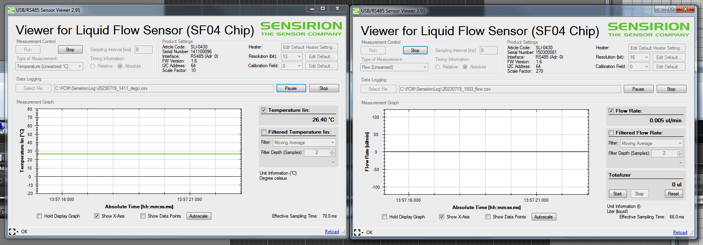

## Sensor Viewer Screenshots

::: note asset "I have most of the Sensor Viewer screenshots"
The screenshots are located in `docs/influx-flight/flight-begin/img/img-flowmeter/` but the pictures need to be:
-   Cropped
-   Annotated
-   Implemented in this page's Markdown file
-   Ideally, image sized reduced with tinypng
:::

<<<<<<< HEAD
## `Sensor Viewer` Software

1.  Start `Sensor Viewer` by clicking the icon on the menu bar at the top of the screen
=======
::: note Include and Image in Markdown using the following Syntax
```markdown
Figure Example Goes Here



-   Skip a line after the image to center figure and caption.
-   The img filepath is relative to this markdown file `setup-flowmeters.md`
```
:::

::: note That Markdown Code renders as
Figure Example Goes Here


-   Skip a line after the image to center figure and caption.
-   The img filepath is relative to this markdown file `setup-flowmeters.md`
:::

## *Sensor Viewer* Software

::: note Using this guide
Throughout this guide, software menu items will be writtwn in `code` font. Sub-Menu items in Drop-down menus will be denoted by a > symbol: `File > Open`.
:::

1.  Start *Sensor View* by clicking the icon on the menu bar at the top of the screen
>>>>>>> d9b6ea89f995c4cc42eb485466464a13880432ad
		-   Once the program is runnning, additional instances of Sensor View can be opened by right clicking on the menu bar item to opening a new window. 
2.  Using the dropdown menus, set the `Sensor Product` to `Liquid Flow Sensor (SF04 Chip)` and the `COM Hardware` to `RS485/USB Sensor Cable`.
3.  After the `Sensor Product` and `COM Hardware` are set, a side menu will open up asking for the COM port to connect to.
4.  There are two flow meters, referred to herein by the last 4 digits of their serial numbers.
    -   Flowmeter `1503` is on COM5 and is the outboard of the two meters. `1503` is closer to the sample cradle.
    -   Flowmeter `1411` is on COM6 and is closer to the nozzle assembly. 
5.  For each flowmeter, select the COM port from the dropdown and click `Ok` at the bottom of the window. Leave the other options on the default values.
<<<<<<< HEAD
    ::: note `Sensor Viewer` COM Ports
=======
    ::: note *Sensor Viewer* COM Ports
>>>>>>> d9b6ea89f995c4cc42eb485466464a13880432ad
    -   The COM port numbers are assigned to the USB ports on HP PC. The software will work regardless of which USB 3.0 (colored blue inside) port you use, but the COM number may change.
    -   You cannot change the `Type Of Measurement` or the `Data Logging` filename while Sensor View is running (ie gathering data from flowmeter). Set those options first.
    :::
6.  Choose the `Type of Measurement` from the dropdown menu in the upper left corner. We use two types of measurements:
    -   `Flow [Linearized]` for sample flow rate and volume measurements 
    -   `Temperature [Linearized C]` for instrument monitoring, curiosity, and posterity.
7.  Unless you have a specific need to measure the sample water temperature, set both flowmeters to `Flow [Linearized]`.
8.  *Optional* Create a logfile to record the flowmeter data. This is not as good as it sounds (see section below).  
    ::: note The logfile will not record the totalizer volume.
    Sensor View records momentary flow rate (or Temperature) at each time point in a csv file.
    :::
<<<<<<< HEAD
9.  Press `Run` in the upper left corner of the `Sensor Viewer` window (`Measurement Control`  box).
1.  *If logging* Start recording the log file by pressing `Start Logging` on the right side of the `Sensor Viewer` window.
1.  If the `Measurement Type` is set to `Flow [Linearized]` (which, if you're reading this, it should be), then `Start` the `Totalizer` on the right side of the `Sensor Viewer` window.


## `Sensor Viewer` Logfile
=======
9.  Press `Run` in the upper left corner of the *Sensor Viewer* window (`Measurement Control`  box).
1.  *If logging* Start recording the log file by pressing `Start Logging` on the right side of the *Sensor Viewer* window.
1.  If the `Measurement Type` is set to `Flow [Linearized]` (which, if you're reading this, it should be), then `Start` the `Totalizer` on the right side of the *Sensor Viewer* window.


## *Sensor Viewer* Logfile
>>>>>>> d9b6ea89f995c4cc42eb485466464a13880432ad

It's not all it's cracked up to be.

### Creating the logfile

The logfile may not be abundantly useful, but it is easy to record.
-   Use `Select File` on the left side of the window to create a logfile in `C:\FCM\SensirionLog` (or a directory of your choosing) with a (suggested) filename of the form `YYYYMMDD_<MeterNumber>_flow.csv`
    ::: note Suggested logfile filename convention
    -   The `YYYYMMDD` is the date. May 25, 1904 would be `19040525`
    -   The `<MeterNumber>` will be `1411` or `1503` (check for the `Serial Number` in the `Product Settings` section in the upper center of the Sensor Viewer window). 
    -   If you are recording `Flow [linearized]` then the final part of the filename will be `flow`. For `Temperatured [Linearized C]`, replace `flow` in the example with `degc`. Creating a filename with the word `temp` as an isolated term seems like trouble.
    -   If recording flow rate data on meter `1411` on May 25, 1904, the filename would be `19040525_1411_flow.csv`.
    -   Hypothetically, it wouldn't be complicated to process these log data to find the points where the flow direction changes, and then use that to integrate the volumes for each sample, based on the time the `.fcs` files are recorded.
    :::


### Logfile Cautions

::: warning Sensor Viewer will overwrite files
<<<<<<< HEAD
`Sensor Viewer` does not like to append liness to logfiles. If you try to `Start Logging` with a filename that already exists, `Sensor Viewer` will ask if you want to **overwrite** that file.
=======
*Sensor Viewer* does not like to append liness to logfiles. If you try to `Start Logging` with a filename that already exists, *Sensor Viewer* will ask if you want to **overwrite** that file.
>>>>>>> d9b6ea89f995c4cc42eb485466464a13880432ad
::: note Pause vs Stop when logging
-   You can pause the logging with `Pause` on the right side of the filepath. 
-   *Stopping* the logging with either `Data Logging`  `Stop` button (to the right of `Pause`) or the `Meassurement Control` `Stop` (upper left corner, next to `Run`) will halt the creation of the logfile. 
-   You will need to begin a new logfile with a new file name to start recording data again. 
-   This happens even if you keep the `Measurement Type` and all other settings the same.
:::
    
::: warning Sensor Viewer defaults to "Relative" time-stamps
The logs will be much easier to interpret if you set the `Timing Information` to **`Absolute`**. 
::: note
-   The default value is `Relative`, which reports your time as a count from when the logging started.
<<<<<<< HEAD
-   Find `Timing Information` in `Measurement Control`, upper left corner of `Sensor Viewer` window.
=======
-   Find `Timing Information` in `Measurement Control`, upper left corner of *Sensor Viewer* window.
>>>>>>> d9b6ea89f995c4cc42eb485466464a13880432ad
:::

---

### 
    

