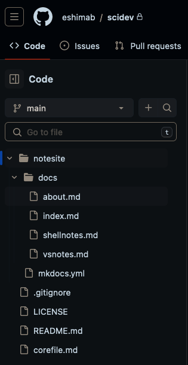
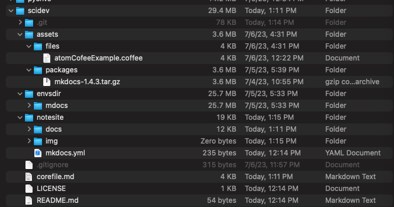
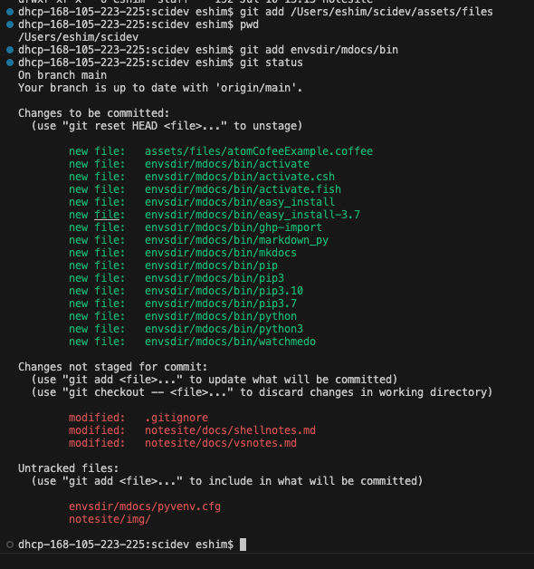
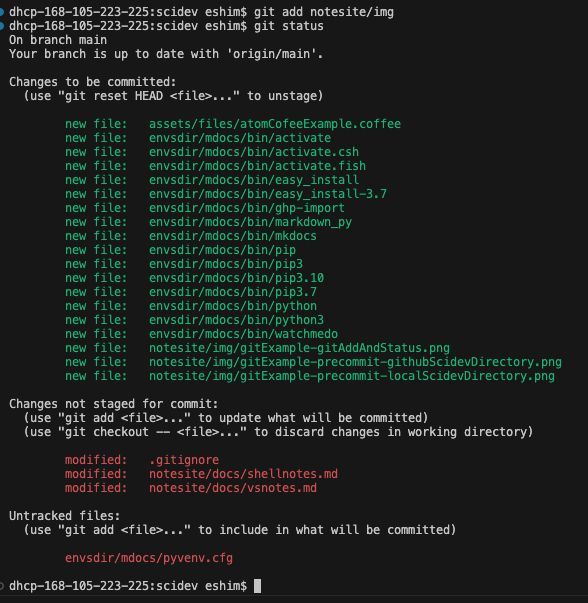
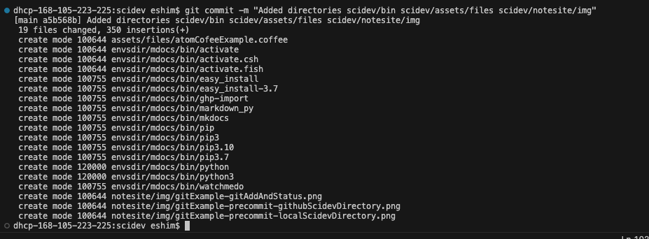
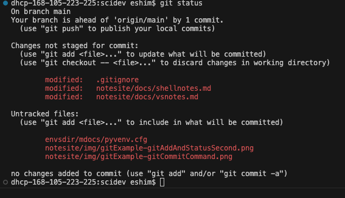
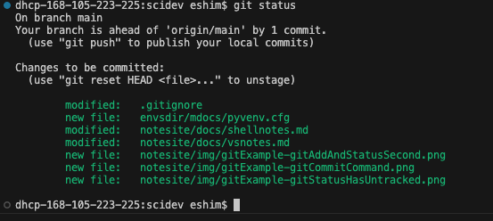
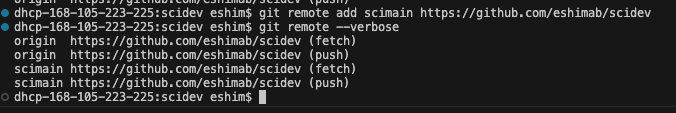
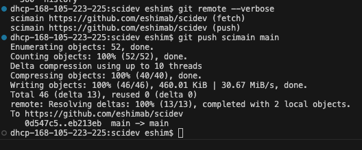

 


# Git

## Git in a Bottle

1. Create a GitHub Free Account
2. Install Homebrew 
3. 

## Working with active git repositories

## Clone Remote Git Repository to Localhost Branch

```bash
cd ~/lifenotes
```

## Git Command Syntax

1. Argument: `commit`
    1. Flag: `-m` or `--message` requires an input of a string (in double quotes) with the commit message
        1. Examples:
            ```bash
            git commit --message "This is the commit message"
            git commit --m "This is the commit message"
            ```
        2. You can add a second, longer `commit` message by using the `--message` (or `-m`) twice
            ```bash
            git commit -m "Summary message" -m "This is a longer description of the commit."
            ```
2. Argument: `checkout`
    1. Flag: `-b` or `--create-branch=` creates a new branch on the local machine and switches to that branch
        1. Input: a plain text name for the new branch e.g. `twig`
            ```bash
            git checkout -b twig
            git checkout --create-branch=twig
            ``` 
3. Argument: `add`
   1. Flag: `-r` or `--recursive`. Git adds directories recursively by default. This flag is rarely needed.

### Comitting a new local directory to the GitHub Repository

#### Git Repo Info
- Github Repository: `https://github.com/eshimab/scidev`
  - Branches
    - `main`



#### Local Git Branch `main`


See that the `assets` dir is located in the local `scidev`
```bash
dhcp-168-105-223-225:scidev eshim$ ls -la
total 56
drwxr-xr-x  11 eshim  staff    352 Jul 10 13:11 .
drwxr-xr-x@ 94 eshim  staff   3008 Jul 10 13:11 ..
-rw-r--r--@  1 eshim  staff  10244 Jul 10 13:49 .DS_Store
drwxr-xr-x  17 eshim  staff    544 Jul 10 13:51 .git
-rw-r--r--   1 eshim  staff    315 Jul  6 23:57 .gitignore
-rw-r--r--   1 eshim  staff   1062 Jul 10 12:14 LICENSE
-rw-r--r--   1 eshim  staff     54 Jul 10 12:14 README.md
drwxr-xr-x   5 eshim  staff    160 Jul  6 16:31 assets
-rw-r--r--   1 eshim  staff   3713 Jul 10 13:11 corefile.md
drwxr-xr-x   4 eshim  staff    128 Jul  5 17:33 envsdir
drwxr-xr-x   6 eshim  staff    192 Jul 10 13:15 notesite
dhcp-168-105-223-225:scidev eshim$ 
```

##### `git add` local dirs and files to prepare for the commit

We want to `git add` the directory `scidev/assets/files/` to our next `git commit`. 
Notes
   - The `-r` or `--recursive` flag is not necessary since Git automatically traverses directories recursively when adding files.
Starting in `~/scidev` directory
```bash
git add assets/files
git add envsdir/mdocs/bin
```
Check `git status`
```bash
git status
```
See Output:



**Example Repeat**: add `scidev/notesite/img/*` (start in `~/scidev`)
```bash
cd ~/scidev
git add notesite/img
```


##### Git Commit vs Push

In Git, a `commit` and a `push` are two separate operations that serve different purposes:

1. Git Commit:
   - Purpose: Creating a new commit to save your changes locally within your Git repository.
   - Usage: The `git commit` command is used to record your changes and create a new commit in your local repository. It captures the current state of your files, including any modifications, additions, or deletions. Each commit has a unique identifier and contains information such as the author, timestamp, and commit message describing the changes.
   - Local Operation: When you run `git commit`, the commit is created only within your local Git repository on your machine. It does not affect the remote repository or other collaborators' copies of the repository.

2. Git Push:
   - Purpose: Sending your local commits to a remote repository, typically hosted on a platform like GitHub, GitLab, or Bitbucket.
   - Usage: The `git push` command is used to upload your local commits to a remote repository. It transfers your committed changes from your local repository to the corresponding branch in the remote repository. This allows you to share your changes with others, collaborate on the project, and synchronize your work with the remote repository.
   - Remote Operation: When you run `git push`, Git sends your committed changes to the remote repository, updating the branch's commit history and files on the remote server. Other collaborators can then fetch or pull your changes into their own local repositories to incorporate your work.

In summary, a `commit` is a local operation that saves your changes within your local repository, while a `push` is used to send your local commits to a remote repository to share and synchronize your changes with others. Commits are made locally, and pushes are performed to update the remote repository with your local commits.


##### Create a local `git commit` to incorporate the changes done with `git add` or changes to files directly in `scidev` because we have been editting the branch `scidev/main`

Commit the directory changes and add a Commit Message using the `-m` flag
```bash
git commit -m "Added directories scidev/bin scidev/assets/files scidev/notesite/img"
```
See Output:


But we still have changes on files that were not added. This message was shown in `git status`



So we need to add these files with `git add`
```bash
# Go to main branch directory
cd ~/scidev
git add .gitignore
git add notesite
git add mdocs/pyvenv.cfg
```
See `git status` output



Now do another commit to `github.io/eshimab/scidev/main`
```bash
git commit -m "Updated notesite, added envsdir/mdoc/pyenvs.cfg, updated .gitignore"
```
See Output


### Managing GitHub Repository Url Aliases with `git remote`

We can check that the repository url is correct by using the `git remote` command with the `get-url` flag for the GitHub repository that we refer to with the local alias `origin`. You can think of `origin` as a short-hand for the repository url. The `origin` alis is created using the `git remote` command with the `add` option to define a local repository URL alias we will call `scimain` from the GitHub Repository 
```bash
git remote add scimain https://github.com/eshimab/scidev
```

List the available Repository URL Aliases using `git remote` without any additional arguments
- Use the `--verbose` or `-v` flag to show additional info 

Screenshot Example:



Now we can remove the old alias `origin` because it points to the same GitHub Repository URL as the new created alias `scimain`
   - Deleting the origin alias will not affect your connection to the remote repository as long as you have another valid remote alias configured.

```bash
git remote remove origin
## Check for changes
git remote --verbose
```

Outputs:
```bash
scimain https://github.com/eshimab/eshimab.github.io (fetch)
scimain https://github.com/eshimab/eshimab.github.io (push)
```

Screenshot Example
 


    ```bash
    dhcp-168-105-223-225:scidev eshim$ git remote --verbose
    
    ```

### Pushing Files with `git push`

##### `git push` the local `git commit` to the GitHub repo/branch `scidev/main` 

- Use the GitHub Repository URL alias `scimain` that points to the full URL `https://github.com/eshimab/scidev` (check this with `git remote --verbose`)

Push the commits done on the local branch `main` with `git push` to the GitHub Repository `scimain` (the alias for `http://github.com/eshimab/scidev`) 
```bash
git push scimain main
```
See output for checking the `git remote` alias name with the `--verbose` flag, then running the `git push` command, sending commits in the local branch `main` to the repository linked in the alias `scimain`.



And the GitHub webpage for `scidev/main` has been updated via the local machine `push`


## Summarizing Git Add/Commit/Push to Repository

1. Stage files with `git add`
   ```bash
   git add *
   ```
   1. Preview if desired with `git status`
2. Commit Staged files with `git commit`
   1. Add a commit message with `-m "message text"`
      ```bash
      git commit -m "updates to notesite"
      ```
3. Push the commit (containing the staged files) to the remote directory using `git remote <local-remote-alias> <local-branch-name>`
   ```bash
   git push scimain main
   ```
   1. You can list the local `<local-remote-alias>` avilable using `git remote --verbose`
      ```bash
      dhcp-168-105-223-225:scidev eshim$ git remote --verbose
      scimain https://github.com/eshimab/scidev (fetch)
      scimain https://github.com/eshimab/scidev (push)
      ``` 
   2. For the above example, the `<local-remote-alias>` is `scimain` and points to `https://github.io/eshimab/scidev`
   3. For this example, the `<local-branch-name>` is `main` and is recorded in the Github repo as `scidev/main` See that we are on branch `main` using `git status`
      ```bash
      dhcp-168-105-223-225:scidev eshim$ git status
      On branch main
      Changes not staged for commit:
      (use "git add <file>..." to update what will be committed)
      (use "git checkout -- <file>..." to discard changes in working directory)

        modified:   notesite/docs/shellnotes.md
       
      no changes added to commit (use "git add" and/or "git commit -a")
      dhcp-168-105-223-225:scidev eshim$ 
      ``` 
4. See Output from `git push scimain main`
   ```bash
   dhcp-168-105-223-225:scidev eshim$ git push scimain main
   Enumerating objects: 15, done.
   Counting objects: 100% (15/15), done.
   Delta compression using up to 10 threads
   Compressing objects: 100% (10/10), done.
   Writing objects: 100% (10/10), 237.52 KiB | 33.93 MiB/s, done.
   Total 10 (delta 4), reused 0 (delta 0)
   remote: Resolving deltas: 100% (4/4), completed with 4 local objects.
   To https://github.com/eshimab/scidev
      eb213eb..4d8a21e  main -> main
   dhcp-168-105-223-225:scidev eshim$
   ```
---

### More standard git setups

#### Adding git hooks

```bash
cd ~/scidev
git add .git/hooks/pre-commit
git add .git/hooks/post-commit
```

## Creat or `checkout` a new Branch

Checkout/Create a new branch `indocs` using `git checkout` with the `-b` flag. The new branch `indocs` is based on the `main` branch in the remote repository `scimain`.

```bash
git checkout -b indocs scimain/main
```

---

### Adding and updating files and directories to an established git repo

### Initializing a git repo using a local directory (with a generic, empty repo already on GitHub)

To use your local "scidev" folder to update your GitHub repository named "scidev" while creating a .gitignore file and a pre-commit Git hook to limit staging to files below 1MB, follow these steps:

- [ ]  Create the .gitignore file:
    - [ ] Open a text editor and create a file named ".gitignore" in the root directory of your "scidev" folder.
    - [ ] Add the necessary patterns to ignore files in the .gitignore file. For example, you can add `*.pdf` to ignore all PDF files.
        ```bash
        # Ignore directories withim scidev:
        # The leading / means that these are subdirectories within scidev where the .gitignore file is found
        # The trailing / means that we are targetting a directory and all it's contents
        /assets/packages/
        /envsdir/mdocs/bin/
        /envsdir/mdocs/lib/
        # 
        # Ignore Filetypes
        *.pdf
        *.mat
        ```
- [ ] Create the pre-commit Git hook:
    - [ ] Open a text editor and create a file named "pre-commit" (without an extension) in the ".git/hooks" directory of your "scidev" repository.
        ```bash
        touch /Users/eshim/scidev/.git/hooks/pre-commit
        ```
    - [ ] Copy and paste the following script into the "pre-commit" file:
        ```bash
        #!/bin/bash
        MAX_FILE_SIZE=1048576  # 1MB in bytes
        # Get the list of staged files
        files=$(git diff --cached --name-only)
        # Loop through the staged files
        for file in $files; do
          # Get the file size in bytes
          file_size=$(wc -c < "$file")
          # Compare file size with the maximum size
          if [ "$file_size" -gt "$MAX_FILE_SIZE" ]; then
            # Remove the file from the staging area
            git reset HEAD "$file"
            echo "File $file exceeds the maximum file size limit. It has been excluded from the commit."
          fi
        done
        #
        exit 0
        ```
    - [ ] Save the file and make it executable by running the following command in the terminal:
        ```bash
        chmod +x /Users/eshim/scidev/.git/hooks/pre-commit
        ```
- [ ] Initialize Git and connect to your GitHub repository:
   - [ ] Open a terminal or command prompt and navigate to your "scidev" folder.
       ```bash
       cd /Users/eshim/scidev
       ``` 
   - [ ] Run the following commands:
     ```bash
     git init
     git remote add origin https://github.com/eshimab/scidev
     ```
   - [ ] Replace `<repository-url>` with the URL of your GitHub repository.
- [ ] Add and commit files:
   - [ ] Add the files you want to include in the commit using `git add`.
   - [ ] Commit the changes using `git commit -m "Initial commit"`.

   ```bash
   git add notesite/**
   git commit -m "Initial Commit for directory notesite/**"
   ``` 

With these steps, your local "scidev" folder will be updated with the .gitignore file and the pre-commit Git hook. The pre-commit hook will exclude files above 1MB from being staged in your commits. Remember to customize the MAX_FILE_SIZE variable in the pre-commit script if you want a different maximum file size limit.

---

# Git Errors

### Push Error?

You will get a `git push` error if the Local Branch is behind the Remote GitHub Repository
Commit Works
```bash
dhcp-168-105-223-225:scidev eshim$ git commit -m "$commit_message"
[main 8ddabfd] Updates to quickstart.md
 5 files changed, 512 insertions(+), 74 deletions(-)
 create mode 100644 notesite/examples/vscode/settings.json
 create mode 100644 scratch.md
```

I try to use `git push` to push commits from my local branch `main` to the Github Repository `scimain/main`

#### Push Command Error

I use Command `git push scimain main`
I get an error because `scimain` is ahead of my local `main`
```bash
dhcp-168-105-223-225:scidev eshim$ git push scimain main
To https://github.com/eshimab/eshimab.github.io
 ! [rejected]        main -> main (non-fast-forward)
error: failed to push some refs to 'https://github.com/eshimab/eshimab.github.io'
hint: Updates were rejected because the tip of your current branch is behind
hint: its remote counterpart. Integrate the remote changes (e.g.
hint: 'git pull ...') before pushing again.
hint: See the 'Note about fast-forwards' in 'git push --help' for details.
dhcp-168-105-223-225:scidev eshim$ 
```

#### Pull Command Error

I try to use `git pull scimain main` To Update my Local Branch `main`
Returns Error:

```bash
E325: ATTENTION
Found a swap file by the name "~/scidev/.git/.MERGE_MSG.swp"
          owned by: eshim   dated: Mon Jul 10 16:42:19 2023
         file name: ~eshim/scidev/.git/MERGE_MSG
          modified: YES
         user name: eshim   host name: dhcp-168-105-223-225.wireless.manoa.haw
        process ID: 23271
While opening file "/Users/eshim/scidev/.git/MERGE_MSG"
             dated: Tue Jul 11 15:11:08 2023
      NEWER than swap file!

(1) Another program may be editing the same file.  If this is the case,
    be careful not to end up with two different instances of the same
    file when making changes.  Quit, or continue with caution.
(2) An edit session for this file crashed.
    If this is the case, use ":recover" or "vim -r /Users/eshim/scidev/.git/MERGE_MSG"
    to recover the changes (see ":help recovery").
    If you did this already, delete the swap file "/Users/eshim/scidev/.git/.MERGE_MSG.swp"
    to avoid this message.

Swap file "~/scidev/.git/.MERGE_MSG.swp" already exists!
[O]pen Read-Only, (E)dit anyway, (R)ecover, (D)elete it, (Q)uit, (A)bort: 
```

#### Solution Delete Old Vim Temporary Files `.MERGE_MSG.swo` and `.MERGE_MSG.swp`

- The file scidev/.git/.MERGE_MSG.swo appears to be a swap file created by the Vim text editor. Vim uses swap files with the .swo extension to store temporary changes made during editing sessions.
    - When you see this file in your Git repository, it usually indicates that you had a Vim session open and either closed it abruptly or encountered an issue while editing the .MERGE_MSG file. The swap file is created to allow recovery of unsaved changes in case of unexpected interruptions.
    - Since this is a temporary file specific to Vim, it is safe to delete it. You can use the following command to remove the swap file:
    ```bash
    rm ~/scidev/.git/.MERGE_MSG.swo
    rm ~/scidev/.git/.MERGE_MSG.swp
    ```

#### Attempt Pull Again: Error

I try the `git pull scimain main` Command and Get Error:

```bash
dhcp-168-105-223-225:scidev eshim$ git pull scimain main
error: You have not concluded your merge (MERGE_HEAD exists).
hint: Please, commit your changes before merging.
fatal: Exiting because of unfinished merge.
```

I use the code from Section **Add/Commit/Push Files to Git Repository** to Commit Changes to my Local Branch.

#### Attempt Push: Success

Push Succeeded!

```bash
git push scimain main
```

#### Attempt Pull:

Pull Attempt Succeeds! Local Branch `main` matches Remote Branch `scidev/main`

```bash
dhcp-168-105-223-225:scidev eshim$ git pull scimain main
From https://github.com/eshimab/eshimab.github.io
 * branch            main       -> FETCH_HEAD
Already up to date.
```

### Remove large files from history

#### Find large files in Git history

This command will list all files in the HEAD commit along with their sizes, sorted in ascending order by file size. The largest files will be listed at the end.
```sh
git ls-tree -r -l HEAD | sort -n -k 4
```
Syntax breakdown:
-   `git` - Calls the git command.
-   `ls-tree` - List the contents of a tree object in Git.
-   `-r` - Recursively display the contents of sub-trees.
-   `-l` - Show object size of blob entries.
-   `HEAD` - Refers to the current commit.
-   `sort` - Sorts the output.
-   `-n` - Numeric sort.
-   `-k 4` - Sort by the fourth column (file size).

List files by filetree:

```sh
git ls-files | xargs -I {} du -h {}
```
Syntax breakdown:
-   `xargs` - Executes a command with the input from standard input.
-   `-I {}` - Replace occurrences of `{}` with each input line.
-   `du` - Estimate file space usage.
-   `-h` - Human-readable output (e.g., 1K, 234M, 2G).


#### Remove large files from Git history

```sh
git filter-branch --index-filter 'git rm -r --cached --ignore-unmatch docs/.vuepress/public/assets/influx' --prune-empty -- --all
rsync -aprv ~/staging/docs/.vuepress/public/assets/influx docs/.vuepress/public/assets
```


Yes, you can target a directory instead of just a single file using the git filter-branch command. The git rm command inside the --index-filter option can accept a directory path, and it will recursively remove all files and directories inside that directory from the Git history.

Replace path/to/directory with the actual path to the directory you want to remove from the Git history. The -r option in git rm indicates that it should recursively remove the directory and all its contents.

Please note that using git filter-branch to remove large files or directories from the Git history can rewrite the history and create a new commit history. This can cause problems for other collaborators if the repository is already shared with others. It's essential to communicate with your collaborators and agree on how to handle the repository history changes before proceeding with this operation.


